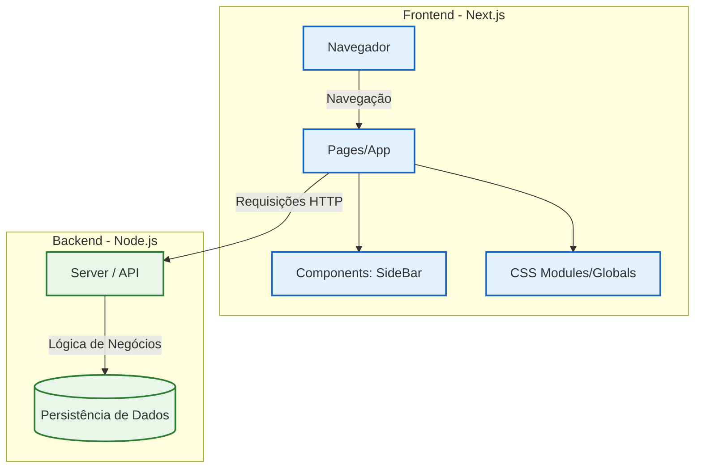

<div align="center">
  <h1>🎟️ Sorteio Rifa</h1>

  **Sistema de gerenciamento para realização e acompanhamento de sorteios e rifas digitais.**

  <p>
    
    
    
    
  </p>
</div>

---

> [!NOTE]
> O **Sorteio Rifa** é uma solução completa para organizar sorteios, estruturada em uma arquitetura robusta que separa o frontend (interface do usuário) do backend (processamento de dados). O sistema permite a gestão de números, participantes e o controle do sorteio de forma eficiente[cite: 3].

---

# 📑 Sumário

- [✨ Funcionalidades](#-funcionalidades)
- [🏗 Arquitetura do Sistema](#-arquitetura-do-sistema)
- [🛠 Tecnologias Utilizadas](#-tecnologias-utilizadas)
- [📁 Estrutura do Projeto](#-estrutura-do-projeto)
- [📄 Licença](#-licença)

---

# ✨ Funcionalidades

O sistema oferece os seguintes recursos fundamentais para a gestão de rifas:

- 🎫 **Gestão de Números:** Controle de números disponíveis e vendidos.
- 👤 **Interface do Usuário:** Dashboard interativo para visualização de sorteios (FrontEnd)[cite: 3].
- ⚙️ **Processamento Backend:** API dedicada para persistência e lógica do sorteio (BackEnd)[cite: 3].
- 📱 **Interface Responsiva:** Design adaptável para visualização em múltiplos dispositivos.
- 🧭 **Navegação Intuitiva:** Componentes organizados como *Sidebars* para facilitar o uso[cite: 3].

---

# 🏗️ Arquitetura do Sistema

O projeto utiliza uma arquitetura baseada em **Client-Server**, onde o Frontend em React (Next.js) se comunica com uma API Node.js para garantir a segurança e a integridade dos dados dos sorteios[cite: 3].


# 🛠 Tecnologias Utilizadas

## Frontend

| Categoria | Tecnologia |
|-----------|------------|
|Framework  | Next.js    |
|Interface  |React       |
|Estilização| CSS        |
|Configuração| jsconfig.json|

---

## Backend 

| Categoria | Tecnologia |
|-----------|------------|
|Runtime | Node.js|
|Servidor| Express.js |
|Gestão de Pacotes| npm|

---

# 📁 Estrutura do Projeto 
```text
Sorteio-Rifa/
├── BackEnd/
│   ├── server.js            # Ponto de entrada do servidor
│   ├── package.json         # Dependências do backend
│   └── .gitignore
│
├── FrontEnd/
│   ├── app/                 # Rotas e Layouts (Next.js)
│   │   ├── layout.jsx
│   │   └── page.jsx
│   ├── src/
│   │   ├── Components/
│   │   │   └── sideBar.jsx  # Componente de navegação lateral
│   │   └── css/             # Estilos customizados
│   ├── next.config.mjs      # Configuração do Next.js
│   └── package.json         # Dependências do frontend
│
└── .gitignore
```
---

# 📄 LicençaEste projeto está licenciado sob a licença MIT.Consulte o arquivo LICENSE para mais informações.

---

# 👨‍💻 Autor

**Silas Santos**
